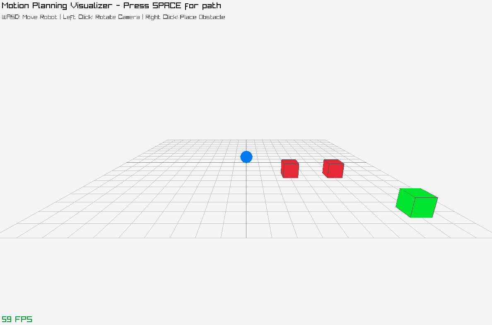

# Motion Planning



3D pathfinding visualization for autonomous robot navigation

## Build
```bash
mkdir build && cd build
cmake ..
make
./motion-planning
```

## Dependencies
- Raylib
- CMake 3.10+

## Roadmap
- Port to Nemesis Engine
- Custom GLTF asset integration with animations
- ImGui overlay for algorithm selection and performance metrics
- Implement additional algorithms (Dijkstra, BFS) for comparison
- Multi-agent simulation with varied movement behaviors
